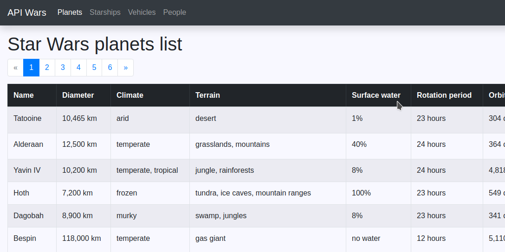

# API Wars

## Description
The program is a small WEB application that displays data about the Star Wars universe (such as planets and starships).

The data is retrieved from the external API: [SWAPI - The Star Wars API](https://swapi.dev/). They are then processed
(for example, the units are added), arranged in the table and then are displayed in the browser window. Some information
is retrieved without refreshing the page.

The application was created as a task at [CodeCool](https://codecool.com/en/) school. A description of the task
as well as additional information can be found in [Wiki](https://github.com/piotrmludzik/api-wars/wiki) section:
- [Exercise](https://github.com/piotrmludzik/api-wars/wiki/Exercise)
- [Technical information](https://github.com/piotrmludzik/api-wars/wiki/Technical-information)

## Screenshots

## Real-time preview
[https://api-wars-pm.herokuapp.com/](https://api-wars-pm.herokuapp.com/)

## Used technologies:

## Challenges:
- create a server and client application from the ground up,
- using AJAX for API requests,
- using Bootstrap,
- deploying the application on-line.

## Future plans:
- implementation of species resources (type of person or character within the Star Wars Universe)
- creating a simple sql database needed for subsequent features,
- login system,
- voting system,
- voting statistics,
- loading indicator while the content is loading,
- improving the color of the website,
- implementation light / dark mode.

## Contact info
Feel free to contact me in case of any issue, questions or comments.
My contact info can be found on my [GitHub page](https://github.com/piotrmludzik).

## License
The content of the exercise and the initial code in the repository are owned by [CodeCool](https://codecool.com/en/).

Copyright (c) 2020 by Piotr Mludzik. All rights reserved.  
Code in this repository is licensed under MIT license. See [LICENSE](https://github.com/piotrmludzik/api-wars/blob/master/LICENSE).